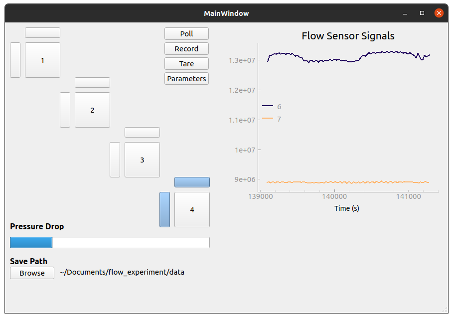

# About this Project
This project was developed in the summer of 2021 as a means for testing experimental carbon-nanotube based flow sensors.  The project combines a graphical user interface (GUI) written in python, and microcontroller written for a Teensy 4.0 using the Arduino ecosystem.  The micro-controller reads sensor values from a set of Analog Devices AD7746 ICs over an I2C connection, buffers the values, and relays them to the computer over a serial connection.  The python program also polls two pressure transducers over serial connection.
# Getting Started
To get a local copy of this project running, follow these steps.
## Prerequisites
## Linux
## Windows
# Use
The GUI displays a representation of how the sensing elements are laid out relative to one another.  A live plot of the streamed sensor values and a bar indicating the measured differential pressure are included for live monitoring of the experiment.

The sensing elements may be clicked to enable the corresponding channel and begin streaming data.  With the desired data streaming, the record button may be pressed to begin writing the data to a file.  The output file can be specified using the browse button in the Save Path field.
# Licence
Distributed under the BSD License. See `LICENSE` for more information.
